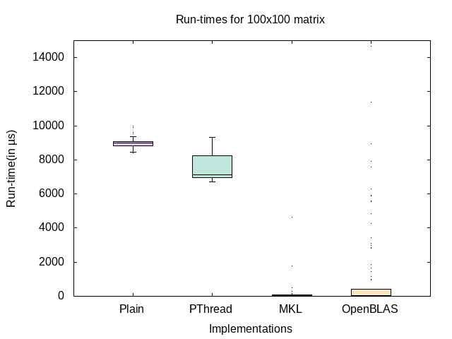
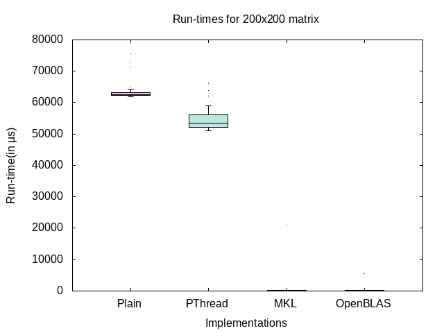
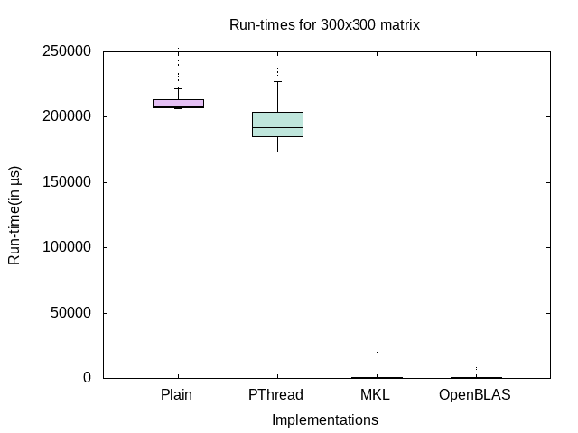

# COP290 Subtask 2


  - [Available Functions](#Available-Functions)
    -   [Fully Connected (FC) Layer](#---fully-connected-fc-layer)
    -   [Non-Linear Activations](#---non-linear-activations)
    -   [Subsampling](#---subsampling)
    -   [Vector of Random Floats To A Vector Of Probabilities](#---vector-of-random-floats-to-a-vector-of-probabilities)
  - [Data fully connected](#data-fully-connected)
  - [Inference](#inference)
  - [Sample Graphs](#sample-graphs)
  - [How to input matrix/vector](#how-to-input-matrixvector)
  - [How to run the code](#how-to-run-the-code)
  - [Internal Implementation](#internal-implementation)
  - [Utils and Misc](#utils-and-misc)
  - [Graphs](#graphs)

## Available Functions
  
  Various functions implemented are:

### -  Fully Connected (FC) Layer

 - Prints a matrix by taking the inner product of an input matrix of dimensions AxB and a weight matrix of dimensions BxC, to output a matrix of dimension AxC. To this output, a bias vector of dimension AXC is then added elementwise.

- 4 implementations available are:
  1. Normal 
    ```
    make
    ./yourcode.out fullyconnected inputmatrix.txt weightmatrix.txt biasmatrix.txt outputmatrix.txt
    ```
  2. pThreads 
    ```
    make
    ./yourcode.out pthread fullyconnected inputmatrix.txt weightmatrix.txt biasmatrix.txt outputmatrix.txt
    ```
  3. MKL 
    ```
    make mkl
    ./yourcode.out mkl fullyconnected inputmatrix.txt weightmatrix.txt biasmatrix.txt outputmatrix.txt
    ```
  4. Openblas 
    ```
    make oblas
    ./yourcode.out oblas fullyconnected inputmatrix.txt weightmatrix.txt biasmatrix.txt outputmatrix.txt
    ```


Filename | Description | Size
------------ | ------------- | -------------
inputmatrix.txt | Contains the input matrix | A x C
weightmatrix.txt | Contains the weight matrix | B x C
biasmatrix.txt | Contains the bias matrix | A x C
outputmatrix.txt | Contains the output matrix obtained by taking inner product of input and weight matrix and adding bias matrix to it | A x C

- **Errors raised**: 
  - Size mismatch for multiplication
  - Size mismatch for addition
    

### -  Non-Linear Activations 
- Prints a matrix with non - linear activations of an input matrix of any size with relu and tanh functions on individual matrix elements

Example:

```
./yourcode.out activation relu inputmatrix.txt outputmatrix.txt
./yourcode.out activation tanh inputmatrix.txt outputmatrix.txt
```

Filename | Description | Size
------------ | ------------- | -------------
inputmatrix.txt | Contains the input matrix | A x B
outputmatrix.txt | Contains the output matrix obtained by applying relu or tanh function on the input matrix | A x B

   

### -  Subsampling

- Prints a matrix with subsampling of square input matrices of any size with max pooling and average pooling functions

Example:

```
./yourcode.out pooling max inputmatrix.txt stride outputmatrix.txt
./yourcode.out pooling average inputmatrix.txt stride outputmatrix.txt
```

Filename | Description | Size
------------ | ------------- | -------------
inputmatrix.txt | Contains the input matrix | A x B
stride | Specify the stride for subsampling | n (Positive Integer)
outputmatrix.txt | Contains the output matrix obtained by subsampling of square input matrices with max pooling or average pooling functions on the input matrix | A x B
    
- **Errors raised**: 
  - Stride size 0
  - Matrix not square
  - Stride does not divide matrix dimension

### -  Vector of Random Floats To A Vector Of Probabilities

- Prints a vector by converting a vector of random floats to a vector of probabilities with softmax and sigmoid functions

Example:

```
./yourcode.out probability softmax inputvector.txt outputvector.txt
./yourcode.out probability sigmoid inputvector.txt outputvector.txt
```

Filename | Description | Size
------------ | ------------- | -------------
inputvector.txt | Contains the input matrix | A x 1
outputvector.txt | Contains vector of probabilities obtained by converting input vector with softmax or sigmoid functions | A x 1
    
<hr>

## Data fully connected

Implementation | Size | Average(in μs) | Stand Dev(in μs)
------------ | ------------- | ------------- | -------------
Plain | 100 x 100 | 9083.77 | 1057.02
Plain | 200 x 200 | 63055.11 | 1912.02
Plain | 300 x 300 | 213294.74 | 11255.28
PThread | 100 x 100 | 7526.6 | 640.79
PThread | 200 x 200 | 54287.89 | 2786.88
PThread | 300 x 300 | 196778.34 | 17200.90
MKL | 100 x 100 | 375.11 | 2546.68
MKL | 200 x 200 | 372.44 | 2092.87
MKL | 300 x 300 | 549.07 | 1989.19
OBlas | 100 x 100 | 1603.51 |4911.01
OBlas | 200 x 200 | 221.77 |535.98
OBlas | 300 x 300 | 519.94 |1041.76

## Inference
What we observed was that MKL was the fastest implementation, then OpenBLAS, then PThreads and the normal implementation was the slowest. There was a huge gap between Pthreads and the optimised libraries.

The mkl and openblas libraries are magnitudes faster than our naiive implementations. While we have tried to optimise our code as much as possible. Eg we pass parameters which dont change as const reference, so that we dont waste time copying parameters. For multiplication, we take transpose of matrix, to convert the column into a continuous vector<float>, as reading contigous memory is faster. pThreads breaks the task into 16 chunks by creating 16 threads. 


## Sample Graphs 





## How to input matrix/vector

- Store vectors as first line having size of vector and after that single values in each line of the file
- Store matrices as first line having column size, 2nd having row size, and after that values of matrix in column major order in each line of the file


<hr>


## How to run the code

Simply run the make file by `make` command for plain and pthreads implementation, `make mkl` command for mkl or `make oblas` for oblas implementation.

Then write the command you want to run, similarly to the example given above. 

The output would be written in the file **outputvector.txt**/**outputmatrix.txt**

Use `make plot` command to make a GNUPlot of the data in /data

## Internal Implementation

To implement the various functions like Fully Connected (FC) Layer ,Non-Linear Activations, Subsampling and Vector of Random Floats To A Vector Of Probabilities, I have created **C++ template classes** with the names Matrix and Vector. The class have functions, to facilitate the implementation, along with operator overloading of + , * operators. Appropriate errors are also raised wherever needed, eg size mismatch, wrong arguments passed, no arguments passed and many more.

For pThreads, the pMatrix class inherits from matrix class and has an extra fc function. This function takes in input as 3 matrix ie input matrix, weight matrix and bias matrix and implement fc by computing the final matrix in 16 threads. Each thread independently computes a part of the final matrix and hence never overlap or interfere as such. The struct pass values via pointers and reference to decrease copying overhead. The transpose of matrix 2 is taken as accessing elements row-wise is faster due to buffer.

For openblas and mkl standard functions from library are implementing the fullyconnected function.For internal implementation we are storing the matrix in an array (We have made arrays of size 10000). For other implementations we are storing the matrix as vector of vectors.

## Utils and Misc

1. Python files like "fc_tester.py","file_comp.py" and "stats.py" are helper files, which were used to generate testing data, assert correctness of functions and compute the SD and Avg of data.
2. debugger.sh implements `make debug`,`make pgebug` and `make debug_all`, used to debug our files.
3. './yourcode.out timer' runs the FC functions on a set of matrices 100 times and generates a .dat file in /data with the run times